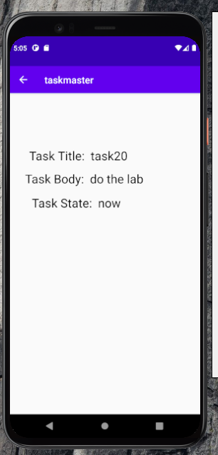
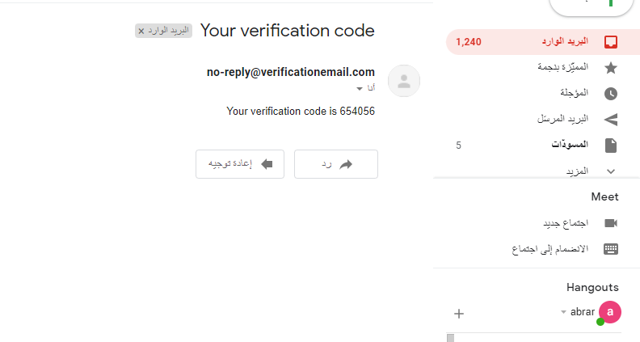

# Taskmaster

# lab 26:
## Building an Android app that contains:

1. Homepage it should have a heading at the top of the page, an image to mock the “my tasks” view,
and buttons at the bottom of the page to allow going to the “add tasks” and “all tasks” page.

2. Add a Task allow users to type in details about a new task, specifically a title and a body. When users click the “submit” button, show a “submitted!” label on the page.

3. All Tasks should just be an image with a back button

## lab 27 :

1. Home page contain three different buttons with hardcoded task titles. When a user taps one of the titles, it goes to the
Task Detail page, and the title at the top of the page match the task title that was tapped on the previous page.
The homepage also contain a button to visit the Settings page, and once the user has entered their username,
it displays “{username}’s tasks” above the three task buttons.

2. Task Detail Page have a title at the top of the page, and a Lorem Ipsum description.

3. Settings Page allow users to enter their username and hit save.

## lab 28 :

1. Refactor homepage to use a RecyclerView for displaying Task data. This have hardcoded Task data for now.

2. you can tap on any one of the Tasks in the RecyclerView, and it will appropriately launch the detail page with the correct Task title displayed and body and state.

## lab 29 :

1. Task Model and Room Following the directions provided in the Android documentation, set up Room in your application, and modify your Task class to be an Entity.

   Add Task Form Modify your Add Task form to save the data entered in as a Task in your local database.

   Homepage Refactor your homepage’s RecyclerView to display all Task entities in your database.

2. Detail Page Ensure that the description and status of a tapped task are also displayed on the detail page, in addition to the title

## Lab: 31 - Espresso and Polish:

1. Espresso Testing : Add Espresso to your application, and use it to test basic functionality of the main components of your application

2. Polish : Complete any remaining feature tasks from previous days’ labs.

## Lab 32 :

1. Using the amplify add api command, create a Task resource that replicates our existing Task schema. Update all references to the Task data to instead use AWS Amplify to access your data in DynamoDB instead of in Room.

### Add Task Form
2. Modify your Add Task form to save the data entered in as a Task to DynamoDB.

### Homepage
3. Refactor your homepage’s RecyclerView to display all Task entities in DynamoDB.

## Lab 33 :

### Related Data
In this lab I created a second entity for a team, which has a name and a list of tasks. So, tasks will be Updated to be owned by a team.

### Add Task Form
Modify your Add Task form to include either a Spinner or Radio Buttons for which team that task belongs to.

### Settings Page
In addition to a username, allow the user to choose their team on the Settings page. Use that Team to display only that team’s tasks on the homepage.

### DynamoDB aws 

## Lab 34: Publishing to the Play Store

This lab is about generate an APK for the application and publishing it to the Google Play Store.

## Lab 36: Cognito

### Main Page

### Sign Up page

### Verification Page

### Sign in Page

### AWS Cognito

## **Lab 37: S3**

### **Add Task Activity**

### **Download Files Page**

### **TaskDetailPage Activity**

### **AWS S3**

